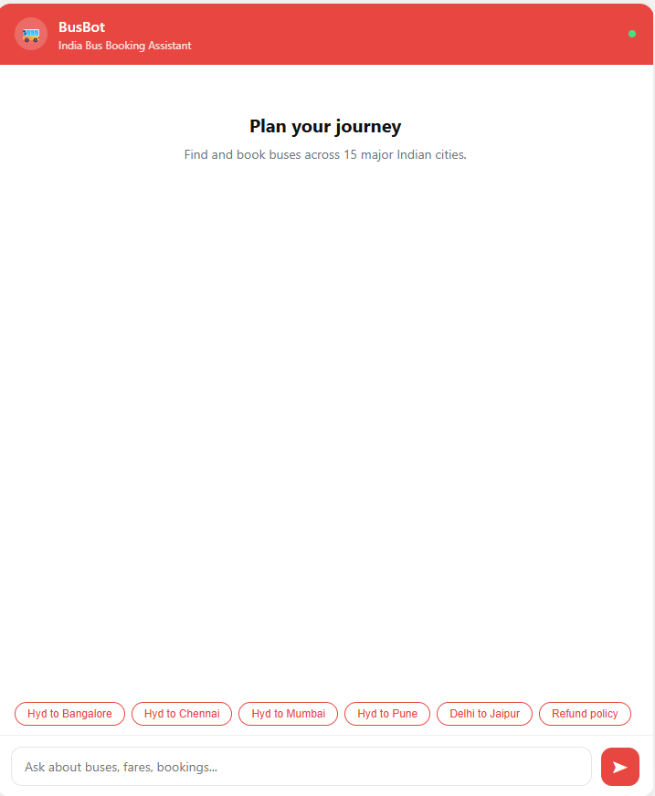
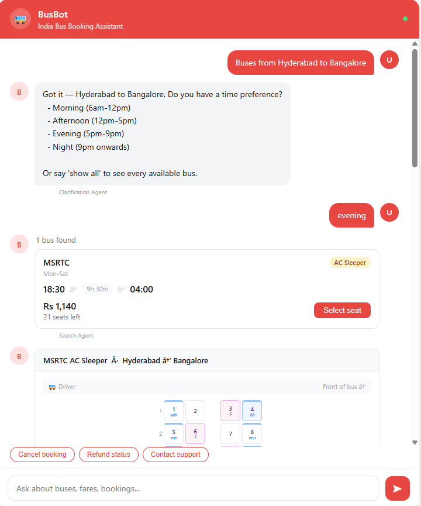
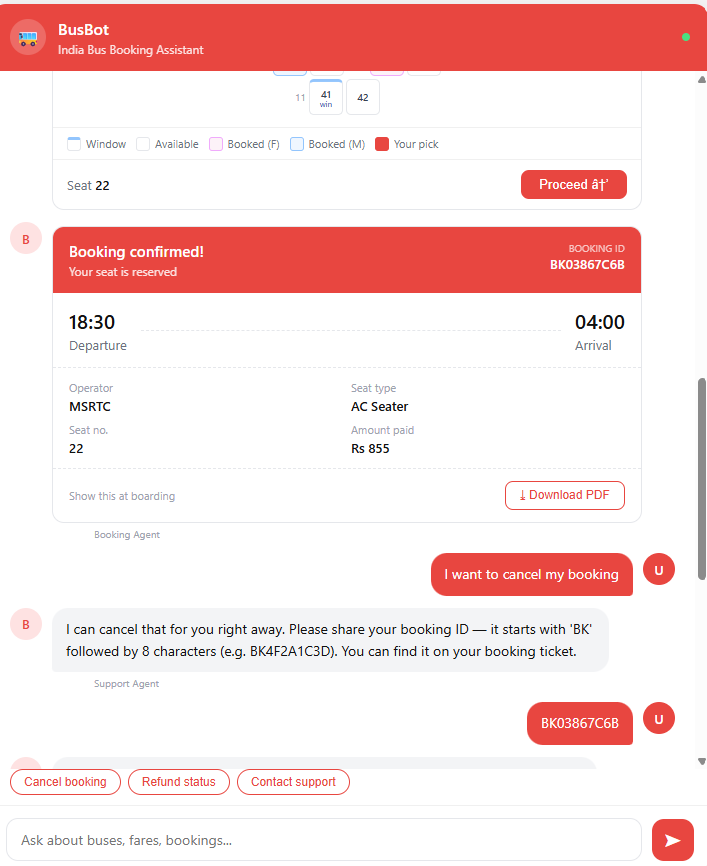
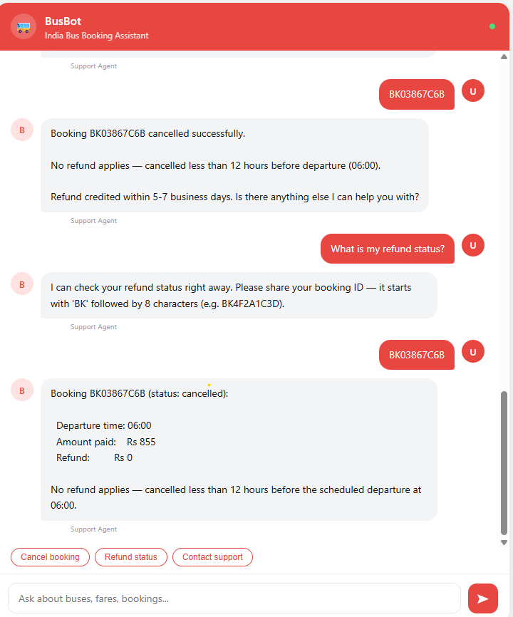

# BusBot — Multi-Agent AI Bus Booking System

A production-grade multi-agent AI system that adds a conversational booking interface on top of India's bus travel ecosystem. Built with LangGraph, FastAPI, Qdrant, and Groq.

## Demo

> Search → Clarification → Seat selection → Booking confirmation — all in natural language.

**Eval scores:** Faithfulness 1.0 · Context Recall 1.0 · Answer Relevancy 0.755 · Overall 0.918

---

## Screenshots

### Home screen


### Bus search Agent


### Booking Agent


### Cancellation Agent


---

## Architecture

```
User → FastAPI (SSE streaming)
         → Orchestrator Agent (intent + semantic guardrails)
              → Clarification Agent (progressive disclosure)
              → Search Agent (Hybrid RAG: BM25 + dense + RRF)
                   → Reflection Agent (self-critique loop)
              → Booking Agent (MCP tool server + SQLite)
              → Support Agent (policy + cancellation)
```

**Key concepts demonstrated:**
- Multi-agent orchestration with LangGraph StateGraph
- Advanced RAG: hybrid BM25 + dense retrieval + Reciprocal Rank Fusion
- MCP (Model Context Protocol) tool server
- Short-term memory (LangGraph MemorySaver) + long-term memory (user profiles)
- Semantic embedding-based guardrails (no keyword lists)
- Self-critique reflection loop
- LangSmith observability
- Custom RAGAS-equivalent evaluation harness

---

## Tech Stack

| Layer | Technology |
|-------|-----------|
| Agent framework | LangGraph + LangChain |
| LLM | llama-3.3-70b via Groq (free tier) |
| Embeddings | nomic-embed-text via Ollama (local, free) |
| Vector DB | Qdrant (local Docker) |
| Sparse retrieval | BM25Okapi (rank-bm25) |
| API | FastAPI + SSE streaming |
| Database | SQLite with seat-level inventory |
| Memory | LangGraph MemorySaver + JSON user profiles |
| Tracing | LangSmith |
| Evaluation | Custom RAGAS-equivalent evaluator |

---

## Project Structure

```
bus-booking-agent/
├── app/
│   ├── agents/          # Orchestrator, search, booking, support, reflection
│   ├── rag/             # Hybrid retriever, indexer, embedder
│   ├── tools/           # MCP tool server + client
│   ├── memory/          # Long-term user profile store
│   ├── api/             # FastAPI endpoints + chat UI
│   └── config.py        # Single config source
├── data/
│   ├── generate.py      # Synthetic bus data generator
│   └── build_documents.py
├── evals/
│   ├── rag_eval.py      # Evaluation harness
│   ├── test_cases.md    # 30 test cases
│   └── results.json     # Latest eval scores
└── README.md
```

---

## Setup and Run

### Prerequisites
- Python 3.10+
- [uv](https://github.com/astral-sh/uv) package manager
- [Ollama](https://ollama.com) (for embeddings)
- [Docker Desktop](https://www.docker.com/products/docker-desktop/) (for Qdrant)
- Free [Groq API key](https://console.groq.com)
- Free [LangSmith API key](https://smith.langchain.com)

### 1 — Clone and install

```bash
git clone https://github.com/YOUR_USERNAME/bus-booking-agent.git
cd bus-booking-agent
uv sync
```

### 2 — Set environment variables

Create `.env`:

```
GROQ_API_KEY=your_groq_key_here
LANGCHAIN_TRACING_V2=true
LANGCHAIN_API_KEY=your_langsmith_key_here
LANGCHAIN_PROJECT=bus-booking-agent
```

### 3 — Start infrastructure

```bash
# Qdrant vector DB
docker run -d -p 6333:6333 -v qdrant_storage:/qdrant/storage qdrant/qdrant

# Ollama embedding model
ollama pull nomic-embed-text
```

### 4 — Generate data and index

```bash
uv run python data/generate.py
uv run python data/build_documents.py
uv run python -m app.rag.indexer
```

### 5 — Run the system

Open 2 terminals:

**Terminal 1 — MCP tool server:**
```bash
uv run python -m app.tools.tool_server
```

**Terminal 2 — Main app:**
```bash
uv run uvicorn app.api.main:app --host 0.0.0.0 --port 8000 --reload
```

Open `http://localhost:8000` in your browser.

---

## Evaluation

```bash
uv run python evals/rag_eval.py
```

| Metric | Score |
|--------|-------|
| Faithfulness | 1.000 |
| Context Recall | 1.000 |
| Answer Relevancy | 0.755 |
| Overall | 0.918 |

---

## Data

- 105 routes across 15 Indian cities
- 309 bus schedules with realistic pricing
- ~12,000 individual seat records with gender and deck data
- Cities: Hyderabad, Bangalore, Chennai, Mumbai, Pune, Delhi, Kolkata, Ahmedabad, Jaipur, Lucknow, Nagpur, Visakhapatnam, Kochi, Coimbatore, Madurai

---

## Author

SAI ASHISH ADHIBATLA — AI Engineer  
[LinkedIn](https://www.linkedin.com/in/sai-ashish-adhibatla-82baa028/)
